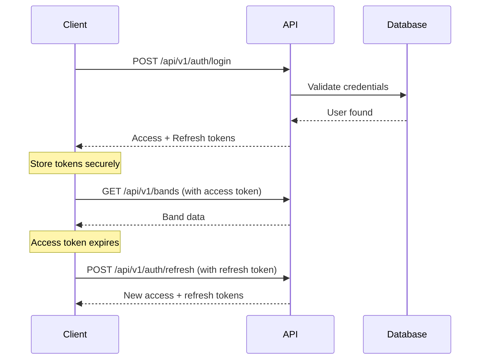

# API Documentation

Comprehensive API guide for the HBCU Band Hub platform.

## Table of Contents

1. [Overview](#overview)
2. [Quick Start](#quick-start)
3. [Authentication](#authentication)
4. [API Versioning](#api-versioning)
5. [Core Endpoints](#core-endpoints)
6. [Code Examples](#code-examples)
7. [Rate Limiting](#rate-limiting)
8. [Error Handling](#error-handling)
9. [Best Practices](#best-practices)

---

## Overview

### Base URLs

| Environment | URL |
|-------------|-----|
| Development | `http://localhost:3001/api` |
| Staging | `https://api.staging.hbcubandhub.com/api` |
| Production | `https://api.hbcubandhub.com/api` |

### Current Version

- **Version**: v1
- **Status**: Stable
- **Format**: `/api/v{number}/{resource}`
- **Example**: `/api/v1/bands`

### Key Features

- **RESTful Architecture**: Standard HTTP methods (GET, POST, PATCH, DELETE)
- **JWT Authentication**: Secure token-based auth with refresh tokens
- **Rate Limiting**: Prevents abuse and ensures fair usage
- **Pagination**: Efficient data retrieval for large datasets
- **Comprehensive Errors**: Clear, actionable error messages
- **API Versioning**: URI-based versioning with deprecation support

---

## Quick Start

### 1. Register a User

```bash
curl -X POST http://localhost:3001/api/v1/auth/register \
  -H "Content-Type: application/json" \
  -d '{
    "email": "admin@bandhub.com",
    "password": "SecurePass123!",
    "name": "John Doe"
  }'
```

### 2. Login

```bash
curl -X POST http://localhost:3001/api/v1/auth/login \
  -H "Content-Type: application/json" \
  -d '{
    "email": "admin@bandhub.com",
    "password": "SecurePass123!"
  }'
```

**Response:**
```json
{
  "accessToken": "eyJhbGciOiJIUzI1NiIsInR5cCI6IkpXVCJ9...",
  "refreshToken": "eyJhbGciOiJIUzI1NiIsInR5cCI6IkpXVCJ9...",
  "expiresIn": 900,
  "user": {
    "id": "clx7yj8k90000uxl9aabbccdd",
    "email": "admin@bandhub.com",
    "name": "John Doe",
    "role": "ADMIN"
  }
}
```

### 3. Make Authenticated Request

```bash
ACCESS_TOKEN="your-access-token"

curl -X GET "http://localhost:3001/api/v1/bands?page=1&limit=10" \
  -H "Authorization: Bearer $ACCESS_TOKEN"
```

---

## Authentication

### Authentication Flow



### Token Management

#### Access Tokens
- **Expiry**: 7 days (configurable via `JWT_ACCESS_EXPIRY`)
- **Storage**: HTTP-only cookies or secure storage
- **Usage**: Include in `Authorization` header

#### Refresh Tokens
- **Expiry**: 30 days (configurable via `JWT_REFRESH_EXPIRY`)
- **Purpose**: Obtain new access tokens without re-login
- **Security**: One-time use with rotation

### Authentication Endpoints

#### Register
```http
POST /api/v1/auth/register
Content-Type: application/json

{
  "email": "user@example.com",
  "password": "SecurePass123!",
  "name": "John Doe"
}
```

**Response (201):**
```json
{
  "id": "...",
  "email": "user@example.com",
  "name": "John Doe",
  "role": "MODERATOR",
  "createdAt": "2026-02-03T10:00:00.000Z"
}
```

#### Login
```http
POST /api/v1/auth/login
Content-Type: application/json

{
  "email": "user@example.com",
  "password": "SecurePass123!"
}
```

#### Refresh Token
```http
POST /api/v1/auth/refresh
Content-Type: application/json

{
  "refreshToken": "eyJhbGciOiJIUzI1NiIsInR5cCI6IkpXVCJ9..."
}
```

#### Get Profile
```http
GET /api/v1/auth/me
Authorization: Bearer <access-token>
```

#### Logout
```http
POST /api/v1/auth/logout
Authorization: Bearer <access-token>
```

#### Forgot Password
```http
POST /api/v1/auth/forgot-password
Content-Type: application/json

{
  "email": "user@example.com"
}
```

#### Reset Password
```http
POST /api/v1/auth/reset-password
Content-Type: application/json

{
  "token": "RESET_TOKEN_FROM_EMAIL",
  "password": "NewSecurePass123!"
}
```

---

## API Versioning

### Versioning Strategy

- **Type**: URI-based versioning
- **Format**: `/api/v{number}/{resource}`
- **Current**: v1
- **Backward Compatibility**: 6 months

### Version Lifecycle

```
v1 Release          v2 Release          v1 Warning          v1 Sunset           v1 Removed
    │                   │                   │                   │                   │
    │◄──────────────────┤◄────3 months─────┤◄────3 months─────┤                   │
    │                   │                   │                   │                   │
    │   Stable v1       │   v1 Deprecated   │   v1 Sunset      │   v1 Removed     │
    │                   │   v2 Stable       │   v2 Stable      │   v2 Stable      │
    └───────────────────┴───────────────────┴──────────────────┴──────────────────►
                                                                                  Time
```

### Deprecation Headers

When a version is deprecated, responses include:

```
Deprecation: version="v1"; date="2026-01-21T00:00:00Z"
Sunset: Wed, 21 Jul 2026 00:00:00 GMT
X-API-Deprecation-Warning: API v1 is deprecated. Please migrate to v2.
X-API-Replacement-Version: v2
Link: </api/docs>; rel="deprecation"; type="text/html"
```

### Version Switching (Frontend)

```typescript
// Set API version
apiClient.setApiVersion('v2');

// Get current version
const version = apiClient.getApiVersion(); // 'v2'

// Handle deprecation warnings
apiClient.setOnDeprecationWarning((warning) => {
  console.warn('API Deprecation:', warning.message);
  console.warn('Sunset Date:', warning.sunsetDate);
  console.warn('Use Version:', warning.replacementVersion);
});
```

---

## Core Endpoints

### Bands

#### List Bands
```http
GET /api/v1/bands?page=1&limit=10&featured=true
Authorization: Bearer <access-token>
```

**Query Parameters:**
- `page` (number): Page number (default: 1)
- `limit` (number): Items per page (default: 20, max: 100)
- `featured` (boolean): Filter featured bands
- `conference` (string): Filter by conference (SWAC, MEAC, etc.)
- `state` (string): Filter by state code
- `search` (string): Search band names

**Response:**
```json
{
  "data": [
    {
      "id": "band-1",
      "name": "Sonic Boom of the South",
      "schoolName": "Jackson State University",
      "city": "Jackson",
      "state": "MS",
      "conference": "SWAC",
      "logoUrl": "https://...",
      "bannerUrl": "https://...",
      "featured": true,
      "videoCount": 245
    }
  ],
  "meta": {
    "total": 67,
    "page": 1,
    "limit": 10,
    "totalPages": 7
  }
}
```

#### Get Band by ID
```http
GET /api/v1/bands/:id
```

#### Get Band by Slug
```http
GET /api/v1/bands/slug/:slug
```

### Videos

#### List Videos
```http
GET /api/v1/videos?page=1&limit=20&bandId=band-1
```

**Query Parameters:**
- `page`, `limit`: Pagination
- `bandId` (string): Filter by band
- `categoryId` (string): Filter by category
- `featured` (boolean): Featured videos only
- `sortBy` (string): Sort field (views, date, title)
- `order` (string): Sort order (asc, desc)

#### Get Video by ID
```http
GET /api/v1/videos/:id
```

#### Increment View Count
```http
POST /api/v1/videos/:id/view
```

### Search

#### Global Search
```http
GET /api/v1/search?q=jackson+state&type=bands,videos
Authorization: Bearer <access-token>
```

**Query Parameters:**
- `q` (string, required): Search query
- `type` (string): Comma-separated types (bands, videos, creators)
- `page`, `limit`: Pagination

**Response:**
```json
{
  "bands": [...],
  "videos": [...],
  "creators": [...],
  "meta": {
    "query": "jackson state",
    "totalResults": 42
  }
}
```

### User Features

#### Favorites

```http
# Add to favorites
POST /api/v1/favorites/:videoId
Authorization: Bearer <access-token>

# Remove from favorites
DELETE /api/v1/favorites/:videoId
Authorization: Bearer <access-token>

# List favorites
GET /api/v1/favorites?page=1&limit=20
Authorization: Bearer <access-token>
```

#### Watch History

```http
# Add to watch history
POST /api/v1/watch-history
Authorization: Bearer <access-token>
Content-Type: application/json

{
  "videoId": "video-1",
  "watchedDuration": 120,
  "totalDuration": 300
}

# Get watch history
GET /api/v1/watch-history?page=1&limit=20
Authorization: Bearer <access-token>
```

### Admin Endpoints

#### Sync Jobs

```http
# List sync jobs
GET /api/v1/admin/sync-jobs?status=IN_PROGRESS&page=1
Authorization: Bearer <admin-token>

# Trigger manual sync
POST /api/v1/admin/sync-jobs/trigger
Authorization: Bearer <admin-token>
Content-Type: application/json

{
  "bandId": "band-1",
  "syncType": "FULL",
  "force": true
}

# Retry failed job
POST /api/v1/admin/sync-jobs/:id/retry
Authorization: Bearer <admin-token>
```

#### Queue Management

```http
# Get queue status
GET /api/v1/admin/queue/status
Authorization: Bearer <admin-token>

# Pause queue
PATCH /api/v1/admin/queue/:queueName/pause
Authorization: Bearer <admin-token>

# Resume queue
PATCH /api/v1/admin/queue/:queueName/resume
Authorization: Bearer <admin-token>
```

---

## Code Examples

### JavaScript/Fetch API

```javascript
class BandHubAPI {
  constructor(baseURL = 'http://localhost:3001/api/v1') {
    this.baseURL = baseURL;
    this.accessToken = null;
    this.refreshToken = null;
  }

  async login(email, password) {
    const response = await fetch(`${this.baseURL}/auth/login`, {
      method: 'POST',
      headers: { 'Content-Type': 'application/json' },
      body: JSON.stringify({ email, password }),
    });

    if (!response.ok) throw new Error('Login failed');

    const data = await response.json();
    this.accessToken = data.accessToken;
    this.refreshToken = data.refreshToken;
    return data;
  }

  async request(endpoint, options = {}) {
    const headers = {
      'Content-Type': 'application/json',
      ...options.headers,
    };

    if (this.accessToken) {
      headers['Authorization'] = `Bearer ${this.accessToken}`;
    }

    const response = await fetch(`${this.baseURL}${endpoint}`, {
      ...options,
      headers,
    });

    if (response.status === 401 && this.refreshToken) {
      await this.refresh();
      return this.request(endpoint, options);
    }

    if (!response.ok) {
      const error = await response.json();
      throw new Error(error.message);
    }

    return response.json();
  }

  async refresh() {
    const response = await fetch(`${this.baseURL}/auth/refresh`, {
      method: 'POST',
      headers: { 'Content-Type': 'application/json' },
      body: JSON.stringify({ refreshToken: this.refreshToken }),
    });

    if (!response.ok) throw new Error('Refresh failed');

    const data = await response.json();
    this.accessToken = data.accessToken;
    this.refreshToken = data.refreshToken;
  }

  async getBands(params = {}) {
    const query = new URLSearchParams(params).toString();
    return this.request(`/bands?${query}`);
  }

  async getBand(id) {
    return this.request(`/bands/${id}`);
  }

  async getVideos(params = {}) {
    const query = new URLSearchParams(params).toString();
    return this.request(`/videos?${query}`);
  }
}

// Usage
const api = new BandHubAPI();

async function main() {
  await api.login('admin@bandhub.com', 'SecurePass123!');
  const bands = await api.getBands({ featured: true, limit: 5 });
  console.log(bands);
}
```

### Python/Requests

```python
import requests

class BandHubAPI:
    def __init__(self, base_url='http://localhost:3001/api/v1'):
        self.base_url = base_url
        self.access_token = None
        self.refresh_token = None
    
    def login(self, email, password):
        response = requests.post(
            f'{self.base_url}/auth/login',
            json={'email': email, 'password': password}
        )
        response.raise_for_status()
        
        data = response.json()
        self.access_token = data['accessToken']
        self.refresh_token = data['refreshToken']
        return data
    
    def _headers(self):
        headers = {'Content-Type': 'application/json'}
        if self.access_token:
            headers['Authorization'] = f'Bearer {self.access_token}'
        return headers
    
    def get_bands(self, **params):
        response = requests.get(
            f'{self.base_url}/bands',
            headers=self._headers(),
            params=params
        )
        response.raise_for_status()
        return response.json()
    
    def get_band(self, band_id):
        response = requests.get(
            f'{self.base_url}/bands/{band_id}',
            headers=self._headers()
        )
        response.raise_for_status()
        return response.json()

# Usage
api = BandHubAPI()
api.login('admin@bandhub.com', 'SecurePass123!')
bands = api.get_bands(featured=True, limit=5)
print(bands)
```

---

## Rate Limiting

### Limits by Endpoint

| Endpoint | Limit | Window |
|----------|-------|--------|
| `/auth/register` | 3 requests | 1 hour |
| `/auth/login` | 5 requests | 15 minutes |
| `/auth/refresh` | 10 requests | 15 minutes |
| `/auth/forgot-password` | 3 requests | 1 hour |
| `/bands` (create) | 3 requests | 1 minute |
| `/search` | 20 requests | 1 minute |
| Default | 100 requests | 1 minute |

### Rate Limit Headers

All responses include rate limit information:

```
X-RateLimit-Limit: 100
X-RateLimit-Remaining: 95
X-RateLimit-Reset: 1706961600
```

### Handling Rate Limits

```javascript
async function apiCall() {
  try {
    const response = await fetch('http://localhost:3001/api/v1/bands');
    
    const limit = response.headers.get('X-RateLimit-Limit');
    const remaining = response.headers.get('X-RateLimit-Remaining');
    const reset = response.headers.get('X-RateLimit-Reset');
    
    console.log(`Rate limit: ${remaining}/${limit}`);
    
    if (remaining < 10) {
      console.warn('Approaching rate limit');
    }
    
    return response.json();
  } catch (error) {
    if (error.status === 429) {
      const resetTime = new Date(parseInt(reset) * 1000);
      console.error(`Rate limited. Try again at ${resetTime}`);
    }
  }
}
```

---

## Error Handling

### Standard Error Response

```json
{
  "statusCode": 400,
  "message": "Validation failed",
  "error": "Bad Request",
  "details": [
    "email must be an email",
    "password must be at least 8 characters"
  ]
}
```

### HTTP Status Codes

| Code | Meaning | Common Causes |
|------|---------|---------------|
| 200 | OK | Request successful |
| 201 | Created | Resource created successfully |
| 400 | Bad Request | Invalid input, validation errors |
| 401 | Unauthorized | Missing or invalid token |
| 403 | Forbidden | Insufficient permissions |
| 404 | Not Found | Resource doesn't exist |
| 409 | Conflict | Duplicate resource (email, etc.) |
| 429 | Too Many Requests | Rate limit exceeded |
| 500 | Internal Server Error | Server error |

### Error Handling Example

```javascript
async function handleApiError(error, response) {
  switch (response.status) {
    case 400:
      console.error('Validation error:', error.details);
      break;
    
    case 401:
      // Try to refresh token
      await refreshToken();
      // Retry request
      break;
    
    case 403:
      console.error('Permission denied');
      // Redirect to access denied page
      break;
    
    case 404:
      console.error('Resource not found');
      break;
    
    case 429:
      const retryAfter = response.headers.get('Retry-After');
      console.error(`Rate limited. Retry after ${retryAfter}s`);
      break;
    
    default:
      console.error('Unexpected error:', error);
  }
}
```

---

## Best Practices

### For API Consumers

1. **Always Specify API Version**
   ```javascript
   // Good
   fetch('http://localhost:3001/api/v1/bands')
   
   // Bad (relies on default)
   fetch('http://localhost:3001/api/bands')
   ```

2. **Handle Token Refresh Gracefully**
   ```javascript
   // Implement automatic retry on 401
   async function apiCall() {
     try {
       return await request('/bands');
     } catch (error) {
       if (error.status === 401) {
         await refreshToken();
         return await request('/bands');
       }
       throw error;
     }
   }
   ```

3. **Respect Rate Limits**
   - Monitor `X-RateLimit-Remaining` header
   - Implement exponential backoff
   - Cache responses when appropriate

4. **Use Pagination**
   ```javascript
   // Good - paginated
   fetch('/api/v1/bands?page=1&limit=20')
   
   // Bad - fetching all at once
   fetch('/api/v1/bands?limit=1000')
   ```

5. **Handle Errors Appropriately**
   - Don't expose API errors directly to users
   - Log errors for debugging
   - Provide user-friendly error messages

### For API Developers

1. **Maintain Backward Compatibility**
   - Add new fields, don't modify existing ones
   - Use optional parameters
   - Version breaking changes

2. **Document All Changes**
   - Keep changelog updated
   - Provide migration guides
   - Announce deprecations early

3. **Monitor API Usage**
   - Track version adoption
   - Monitor error rates
   - Watch for unusual patterns

4. **Test Thoroughly**
   - Test all supported versions
   - Validate inputs
   - Handle edge cases

---

## Additional Resources

- **Swagger UI**: http://localhost:3001/api/docs
- **Health Check**: http://localhost:3001/api/health
- **Metrics**: http://localhost:3001/api/metrics
- **GitHub**: https://github.com/JFenderson/BandHub
- **Support**: support@hbcubandhub.com
