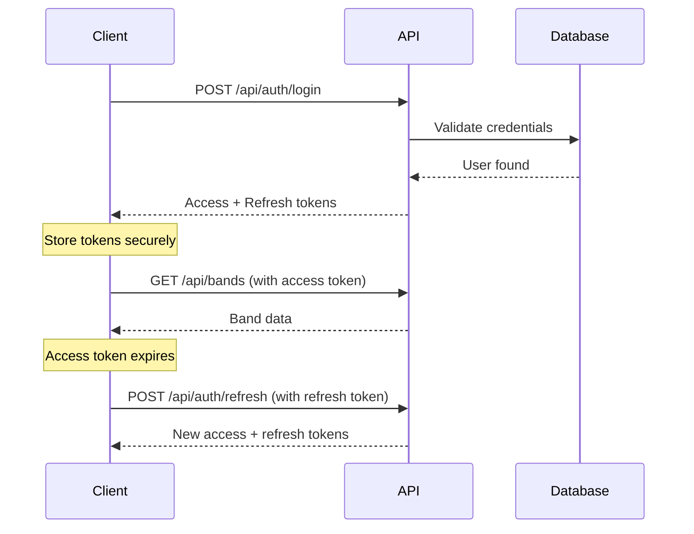

# HBCU Band Hub API - Usage Examples

This document provides practical examples for using the HBCU Band Hub API with various tools and programming languages.

## Table of Contents

- [Authentication Flow](#authentication-flow)
- [cURL Examples](#curl-examples)
- [JavaScript/Node.js Examples](#javascriptnodejs-examples)
- [Python Examples](#python-examples)
- [Postman Collection](#postman-collection)
- [Common Workflows](#common-workflows)
- [Error Handling](#error-handling)

---

## Authentication Flow

### Standard Login Flow



---

## cURL Examples

### 1. Register a New User

```bash
curl -X POST http://localhost:3001/api/auth/register \
  -H "Content-Type: application/json" \
  -d '{
    "email": "admin@bandhub.com",
    "password": "SecurePass123!",
    "name": "John Doe"
  }'
```

**Response:**
```json
{
  "id": "clx7yj8k90000uxl9aabbccdd",
  "email": "admin@bandhub.com",
  "name": "John Doe",
  "role": "MODERATOR",
  "createdAt": "2024-01-15T10:30:00.000Z"
}
```

### 2. Login

```bash
curl -X POST http://localhost:3001/api/auth/login \
  -H "Content-Type: application/json" \
  -d '{
    "email": "admin@bandhub.com",
    "password": "SecurePass123!"
  }'
```

**Response:**
```json
{
  "accessToken": "eyJhbGciOiJIUzI1NiIsInR5cCI6IkpXVCJ9...",
  "refreshToken": "eyJhbGciOiJIUzI1NiIsInR5cCI6IkpXVCJ9...",
  "expiresIn": 900,
  "user": {
    "id": "clx7yj8k90000uxl9aabbccdd",
    "email": "admin@bandhub.com",
    "name": "John Doe",
    "role": "ADMIN"
  }
}
```

### 3. Get Current User Profile

```bash
# Save the access token from login
ACCESS_TOKEN="eyJhbGciOiJIUzI1NiIsInR5cCI6IkpXVCJ9..."

curl -X GET http://localhost:3001/api/auth/me \
  -H "Authorization: Bearer $ACCESS_TOKEN"
```

**Response:**
```json
{
  "id": "clx7yj8k90000uxl9aabbccdd",
  "email": "admin@bandhub.com",
  "name": "John Doe",
  "role": "ADMIN"
}
```

### 4. Refresh Access Token

```bash
REFRESH_TOKEN="eyJhbGciOiJIUzI1NiIsInR5cCI6IkpXVCJ9..."

curl -X POST http://localhost:3001/api/auth/refresh \
  -H "Content-Type: application/json" \
  -d "{
    \"refreshToken\": \"$REFRESH_TOKEN\"
  }"
```

**Response:**
```json
{
  "accessToken": "eyJhbGciOiJIUzI1NiIsInR5cCI6IkpXVCJ9...",
  "refreshToken": "eyJhbGciOiJIUzI1NiIsInR5cCI6IkpXVCJ9...",
  "expiresIn": 900
}
```

### 5. Forgot Password

```bash
curl -X POST http://localhost:3001/api/auth/forgot-password \
  -H "Content-Type: application/json" \
  -d '{
    "email": "admin@bandhub.com"
  }'
```

**Response:**
```json
{
  "message": "If the email exists, a reset link has been sent"
}
```

### 6. Reset Password

```bash
curl -X POST http://localhost:3001/api/auth/reset-password \
  -H "Content-Type: application/json" \
  -d '{
    "token": "a1b2c3d4e5f6g7h8i9j0k1l2m3n4o5p6",
    "password": "NewSecurePass123!"
  }'
```

**Response:**
```json
{
  "message": "Password reset successful. Please login with your new password."
}
```

### 7. Logout

```bash
curl -X POST http://localhost:3001/api/auth/logout \
  -H "Authorization: Bearer $ACCESS_TOKEN"
```

**Response:**
```json
{
  "message": "Logged out successfully"
}
```

### 8. Logout from All Devices

```bash
curl -X POST http://localhost:3001/api/auth/logout-all \
  -H "Authorization: Bearer $ACCESS_TOKEN"
```

**Response:**
```json
{
  "message": "Logged out from all devices successfully"
}
```

### 9. Get Bands List (Protected Endpoint Example)

```bash
curl -X GET "http://localhost:3001/api/v1/bands?page=1&limit=10" \
  -H "Authorization: Bearer $ACCESS_TOKEN"
```

**Response:**
```json
{
  "data": [
    {
      "id": "band-1",
      "name": "Sonic Boom of the South",
      "schoolName": "Jackson State University",
      "city": "Jackson",
      "state": "MS",
      "conference": "SWAC"
    }
  ],
  "meta": {
    "total": 1,
    "page": 1,
    "limit": 10,
    "totalPages": 1
  }
}
```

---

## JavaScript/Node.js Examples

### Using Fetch API

```javascript
// 1. Login and store tokens
async function login(email, password) {
  const response = await fetch('http://localhost:3001/api/auth/login', {
    method: 'POST',
    headers: {
      'Content-Type': 'application/json',
    },
    body: JSON.stringify({ email, password }),
  });

  if (!response.ok) {
    throw new Error(`Login failed: ${response.statusText}`);
  }

  const data = await response.json();
  
  // Store tokens securely (e.g., in httpOnly cookies or secure storage)
  localStorage.setItem('accessToken', data.accessToken);
  localStorage.setItem('refreshToken', data.refreshToken);
  
  return data;
}

// 2. Make authenticated request
async function getProfile() {
  const accessToken = localStorage.getItem('accessToken');
  
  const response = await fetch('http://localhost:3001/api/auth/me', {
    method: 'GET',
    headers: {
      'Authorization': `Bearer ${accessToken}`,
    },
  });

  if (!response.ok) {
    if (response.status === 401) {
      // Token expired, try to refresh
      await refreshTokens();
      return getProfile(); // Retry
    }
    throw new Error(`Request failed: ${response.statusText}`);
  }

  return response.json();
}

// 3. Refresh tokens when access token expires
async function refreshTokens() {
  const refreshToken = localStorage.getItem('refreshToken');
  
  const response = await fetch('http://localhost:3001/api/auth/refresh', {
    method: 'POST',
    headers: {
      'Content-Type': 'application/json',
    },
    body: JSON.stringify({ refreshToken }),
  });

  if (!response.ok) {
    // Refresh token expired, redirect to login
    logout();
    throw new Error('Session expired. Please login again.');
  }

  const data = await response.json();
  
  // Update tokens
  localStorage.setItem('accessToken', data.accessToken);
  localStorage.setItem('refreshToken', data.refreshToken);
  
  return data;
}

// 4. Logout
async function logout() {
  const accessToken = localStorage.getItem('accessToken');
  
  try {
    await fetch('http://localhost:3001/api/auth/logout', {
      method: 'POST',
      headers: {
        'Authorization': `Bearer ${accessToken}`,
      },
    });
  } finally {
    // Clear tokens regardless of API response
    localStorage.removeItem('accessToken');
    localStorage.removeItem('refreshToken');
  }
}

// Usage example
(async () => {
  try {
    // Login
    const loginData = await login('admin@bandhub.com', 'SecurePass123!');
    console.log('Logged in:', loginData.user);

    // Get profile
    const profile = await getProfile();
    console.log('Profile:', profile);

    // Logout
    await logout();
    console.log('Logged out');
  } catch (error) {
    console.error('Error:', error.message);
  }
})();
```

### Using Axios (with interceptor for token refresh)

```javascript
const axios = require('axios');

// Create axios instance
const api = axios.create({
  baseURL: 'http://localhost:3001/api',
  headers: {
    'Content-Type': 'application/json',
  },
});

// Add request interceptor to attach token
api.interceptors.request.use(
  (config) => {
    const token = localStorage.getItem('accessToken');
    if (token) {
      config.headers.Authorization = `Bearer ${token}`;
    }
    return config;
  },
  (error) => Promise.reject(error)
);

// Add response interceptor to handle token refresh
let isRefreshing = false;
let refreshSubscribers = [];

function onRefreshed(token) {
  refreshSubscribers.forEach((callback) => callback(token));
  refreshSubscribers = [];
}

function addRefreshSubscriber(callback) {
  refreshSubscribers.push(callback);
}

api.interceptors.response.use(
  (response) => response,
  async (error) => {
    const originalRequest = error.config;

    // If 401 and we haven't tried to refresh yet
    if (error.response?.status === 401 && !originalRequest._retry) {
      if (isRefreshing) {
        // Wait for refresh to complete
        return new Promise((resolve) => {
          addRefreshSubscriber((token) => {
            originalRequest.headers.Authorization = `Bearer ${token}`;
            resolve(api(originalRequest));
          });
        });
      }

      originalRequest._retry = true;
      isRefreshing = true;

      try {
        const refreshToken = localStorage.getItem('refreshToken');
        const response = await axios.post(
          'http://localhost:3001/api/auth/refresh',
          { refreshToken }
        );

        const { accessToken } = response.data;
        localStorage.setItem('accessToken', accessToken);
        
        isRefreshing = false;
        onRefreshed(accessToken);

        originalRequest.headers.Authorization = `Bearer ${accessToken}`;
        return api(originalRequest);
      } catch (refreshError) {
        isRefreshing = false;
        // Redirect to login
        localStorage.clear();
        window.location.href = '/login';
        return Promise.reject(refreshError);
      }
    }

    return Promise.reject(error);
  }
);

// Usage
async function example() {
  try {
    // Login
    const { data: loginData } = await api.post('/auth/login', {
      email: 'admin@bandhub.com',
      password: 'SecurePass123!',
    });

    localStorage.setItem('accessToken', loginData.accessToken);
    localStorage.setItem('refreshToken', loginData.refreshToken);

    // Get bands (will automatically attach token and refresh if needed)
    const { data: bands } = await api.get('/v1/bands');
    console.log('Bands:', bands);

    // Logout
    await api.post('/auth/logout');
    localStorage.clear();
  } catch (error) {
    console.error('Error:', error.response?.data || error.message);
  }
}

example();
```

---

## Python Examples

### Using requests library

```python
import requests
import json

class BandHubAPI:
    def __init__(self, base_url='http://localhost:3001/api'):
        self.base_url = base_url
        self.access_token = None
        self.refresh_token = None
    
    def login(self, email, password):
        """Login and store tokens"""
        response = requests.post(
            f'{self.base_url}/auth/login',
            json={'email': email, 'password': password}
        )
        response.raise_for_status()
        
        data = response.json()
        self.access_token = data['accessToken']
        self.refresh_token = data['refreshToken']
        
        return data
    
    def refresh_tokens(self):
        """Refresh access token"""
        response = requests.post(
            f'{self.base_url}/auth/refresh',
            json={'refreshToken': self.refresh_token}
        )
        response.raise_for_status()
        
        data = response.json()
        self.access_token = data['accessToken']
        self.refresh_token = data['refreshToken']
        
        return data
    
    def _request(self, method, endpoint, **kwargs):
        """Make authenticated request with automatic token refresh"""
        headers = kwargs.pop('headers', {})
        headers['Authorization'] = f'Bearer {self.access_token}'
        
        response = requests.request(
            method,
            f'{self.base_url}{endpoint}',
            headers=headers,
            **kwargs
        )
        
        # If unauthorized, try to refresh token
        if response.status_code == 401:
            self.refresh_tokens()
            headers['Authorization'] = f'Bearer {self.access_token}'
            response = requests.request(
                method,
                f'{self.base_url}{endpoint}',
                headers=headers,
                **kwargs
            )
        
        response.raise_for_status()
        return response.json()
    
    def get_profile(self):
        """Get current user profile"""
        return self._request('GET', '/auth/me')
    
    def get_bands(self, page=1, limit=10):
        """Get bands list"""
        return self._request('GET', f'/v1/bands?page={page}&limit={limit}')
    
    def logout(self):
        """Logout"""
        return self._request('POST', '/auth/logout')

# Usage
if __name__ == '__main__':
    api = BandHubAPI()
    
    # Login
    login_data = api.login('admin@bandhub.com', 'SecurePass123!')
    print(f"Logged in as: {login_data['user']['email']}")
    
    # Get profile
    profile = api.get_profile()
    print(f"Profile: {profile}")
    
    # Get bands
    bands = api.get_bands(page=1, limit=5)
    print(f"Bands: {bands}")
    
    # Logout
    api.logout()
    print("Logged out")
```

---

## Postman Collection

### Import Instructions

1. Open Postman
2. Click "Import" button
3. Select "Raw text" tab
4. Paste the JSON below
5. Click "Import"

### Collection JSON

```json
{
  "info": {
    "name": "HBCU Band Hub API",
    "description": "Complete API collection for HBCU Band Hub",
    "schema": "https://schema.getpostman.com/json/collection/v2.1.0/collection.json"
  },
  "auth": {
    "type": "bearer",
    "bearer": [
      {
        "key": "token",
        "value": "{{accessToken}}",
        "type": "string"
      }
    ]
  },
  "variable": [
    {
      "key": "baseUrl",
      "value": "http://localhost:3001/api",
      "type": "string"
    },
    {
      "key": "accessToken",
      "value": "",
      "type": "string"
    },
    {
      "key": "refreshToken",
      "value": "",
      "type": "string"
    }
  ],
  "item": [
    {
      "name": "Authentication",
      "item": [
        {
          "name": "Register",
          "request": {
            "method": "POST",
            "header": [],
            "body": {
              "mode": "raw",
              "raw": "{\n  \"email\": \"admin@bandhub.com\",\n  \"password\": \"SecurePass123!\",\n  \"name\": \"John Doe\"\n}",
              "options": {
                "raw": {
                  "language": "json"
                }
              }
            },
            "url": {
              "raw": "{{baseUrl}}/auth/register",
              "host": ["{{baseUrl}}"],
              "path": ["auth", "register"]
            }
          }
        },
        {
          "name": "Login",
          "event": [
            {
              "listen": "test",
              "script": {
                "exec": [
                  "if (pm.response.code === 200) {",
                  "    const response = pm.response.json();",
                  "    pm.collectionVariables.set('accessToken', response.accessToken);",
                  "    pm.collectionVariables.set('refreshToken', response.refreshToken);",
                  "}"
                ]
              }
            }
          ],
          "request": {
            "method": "POST",
            "header": [],
            "body": {
              "mode": "raw",
              "raw": "{\n  \"email\": \"admin@bandhub.com\",\n  \"password\": \"SecurePass123!\"\n}",
              "options": {
                "raw": {
                  "language": "json"
                }
              }
            },
            "url": {
              "raw": "{{baseUrl}}/auth/login",
              "host": ["{{baseUrl}}"],
              "path": ["auth", "login"]
            }
          }
        },
        {
          "name": "Refresh Token",
          "event": [
            {
              "listen": "test",
              "script": {
                "exec": [
                  "if (pm.response.code === 200) {",
                  "    const response = pm.response.json();",
                  "    pm.collectionVariables.set('accessToken', response.accessToken);",
                  "    pm.collectionVariables.set('refreshToken', response.refreshToken);",
                  "}"
                ]
              }
            }
          ],
          "request": {
            "method": "POST",
            "header": [],
            "body": {
              "mode": "raw",
              "raw": "{\n  \"refreshToken\": \"{{refreshToken}}\"\n}",
              "options": {
                "raw": {
                  "language": "json"
                }
              }
            },
            "url": {
              "raw": "{{baseUrl}}/auth/refresh",
              "host": ["{{baseUrl}}"],
              "path": ["auth", "refresh"]
            }
          }
        },
        {
          "name": "Get Profile",
          "request": {
            "method": "GET",
            "header": [],
            "url": {
              "raw": "{{baseUrl}}/auth/me",
              "host": ["{{baseUrl}}"],
              "path": ["auth", "me"]
            }
          }
        },
        {
          "name": "Logout",
          "request": {
            "method": "POST",
            "header": [],
            "url": {
              "raw": "{{baseUrl}}/auth/logout",
              "host": ["{{baseUrl}}"],
              "path": ["auth", "logout"]
            }
          }
        }
      ]
    }
  ]
}
```

---

## Common Workflows

### 1. Complete Authentication Flow

```bash
# Step 1: Register
curl -X POST http://localhost:3001/api/auth/register \
  -H "Content-Type: application/json" \
  -d '{"email":"user@example.com","password":"SecurePass123!","name":"Test User"}'

# Step 2: Login
LOGIN_RESPONSE=$(curl -s -X POST http://localhost:3001/api/auth/login \
  -H "Content-Type: application/json" \
  -d '{"email":"user@example.com","password":"SecurePass123!"}')

# Extract tokens
ACCESS_TOKEN=$(echo $LOGIN_RESPONSE | jq -r '.accessToken')
REFRESH_TOKEN=$(echo $LOGIN_RESPONSE | jq -r '.refreshToken')

# Step 3: Use access token
curl -X GET http://localhost:3001/api/auth/me \
  -H "Authorization: Bearer $ACCESS_TOKEN"

# Step 4: When token expires, refresh
NEW_TOKENS=$(curl -s -X POST http://localhost:3001/api/auth/refresh \
  -H "Content-Type: application/json" \
  -d "{\"refreshToken\":\"$REFRESH_TOKEN\"}")

ACCESS_TOKEN=$(echo $NEW_TOKENS | jq -r '.accessToken')

# Step 5: Logout
curl -X POST http://localhost:3001/api/auth/logout \
  -H "Authorization: Bearer $ACCESS_TOKEN"
```

### 2. Password Reset Flow

```bash
# Step 1: Request password reset
curl -X POST http://localhost:3001/api/auth/forgot-password \
  -H "Content-Type: application/json" \
  -d '{"email":"user@example.com"}'

# Step 2: Check email for reset token
# (In development, check server logs for the token)

# Step 3: Reset password with token
curl -X POST http://localhost:3001/api/auth/reset-password \
  -H "Content-Type: application/json" \
  -d '{
    "token":"RESET_TOKEN_FROM_EMAIL",
    "password":"NewSecurePass123!"
  }'

# Step 4: Login with new password
curl -X POST http://localhost:3001/api/auth/login \
  -H "Content-Type: application/json" \
  -d '{"email":"user@example.com","password":"NewSecurePass123!"}'
```

---

## Error Handling

### Common Error Responses

#### 400 Bad Request
```json
{
  "statusCode": 400,
  "message": [
    "email must be an email",
    "password must be at least 8 characters"
  ],
  "error": "Bad Request"
}
```

#### 401 Unauthorized
```json
{
  "statusCode": 401,
  "message": "Invalid credentials",
  "error": "Unauthorized"
}
```

#### 429 Too Many Requests
```json
{
  "statusCode": 429,
  "message": "Too many login attempts. Please try again in 15 minutes.",
  "error": "Too Many Requests"
}
```

### Handling Errors in Code

```javascript
async function apiCall() {
  try {
    const response = await fetch('http://localhost:3001/api/auth/login', {
      method: 'POST',
      headers: { 'Content-Type': 'application/json' },
      body: JSON.stringify({ email: 'test@example.com', password: 'pass' })
    });

    if (!response.ok) {
      const error = await response.json();
      
      switch (response.status) {
        case 400:
          console.error('Validation error:', error.message);
          break;
        case 401:
          console.error('Authentication failed:', error.message);
          break;
        case 429:
          console.error('Rate limit exceeded:', error.message);
          break;
        default:
          console.error('Unexpected error:', error);
      }
      
      throw new Error(error.message);
    }

    return await response.json();
  } catch (error) {
    console.error('Request failed:', error);
    throw error;
  }
}
```

---

## Rate Limits

| Endpoint | Limit | Window |
|----------|-------|--------|
| `/auth/register` | 3 requests | 1 hour |
| `/auth/login` | 5 requests | 15 minutes |
| `/auth/refresh` | 10 requests | 15 minutes |
| `/auth/forgot-password` | 3 requests | 1 hour |
| `/auth/reset-password` | 3 requests | 1 hour |

**Rate Limit Headers:**
```
X-RateLimit-Limit: 5
X-RateLimit-Remaining: 4
X-RateLimit-Reset: 1234567890
```

---

## Additional Resources

- **Swagger UI:** http://localhost:3001/api/docs
- **API Health Check:** http://localhost:3001/api/health
- **API Base URL (Dev):** http://localhost:3001/api
- **API Base URL (Staging):** https://api.staging.hbcubandhub.com
- **API Base URL (Production):** https://api.hbcubandhub.com

---

## Need Help?

- **GitHub Issues:** https://github.com/JFenderson/BandHub/issues
- **Documentation:** See `/docs` directory
- **Email Support:** support@hbcubandhub.com
